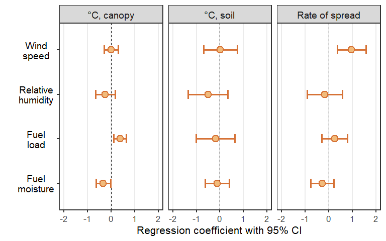

---
output:
  word_document:
    reference_docx: word_template.docx
    keep_md: yes
---

<!-- Table 1: Results of generalized linear mixed effect regression models testing three measure of fire behavior against four potential predictor variables. Statistics reflect pooled results of 50 imputed datasets using the *mice* package in R; see Methods. Vapor pressure deficit included for Rate of spread only due to statistically-significant difference between GLMM regression results that included VPD compared to RH alone (Wald = 5.32, P = 0.02), while temperature models had no such difference. -->

<!-- |Response           |Model term             |       t df  |      P| -->
<!-- |:------------------|:----------------------|------------:|------:| -->
<!-- |Rate of spread     |                       |             |       | -->
<!-- |                   |Wind speed             |  2.92 108.0 | < 0.01| -->
<!-- |                   |Vapor pressure deficit | -2.31 108.1 |   0.02| -->
<!-- |                   |Relative humidity      | -1.66 80.8  |   0.10| -->
<!-- |                   |Fuel load              |  1.16 49.9  |   0.25| -->
<!-- |                   |Fuel moisture          | -0.68 62.9  |   0.50| -->
<!-- |Canopy temperature |                       |             |       | -->
<!-- |                   |Fuel load              |  2.82 54.2  |   0.01| -->
<!-- |                   |Fuel moisture          | -2.16 40.9  |   0.04| -->
<!-- |                   |Relative humidity      | -1.19 120.4 |   0.24| -->
<!-- |                   |Wind speed             |  0.02 132.4 |   0.99| -->
<!-- |Surface temperature|                       |             |       | -->
<!-- |                   |Relative humidity      | -1.19 74.8  |   0.24| -->
<!-- |                   |Fuel load              | -0.48 20.1  |   0.64| -->
<!-- |                   |Fuel moisture          | -0.47 40.1  |   0.64| -->
<!-- |                   |Wind speed             |  0.06 49.5  |   0.95| -->

Figure  1: Violin plots of weather, fuel, and fire behavior response variables for fires in southwestern North Dakota (Hettinger, dark maroon) and central North Dakota (Central Grasslands, light blue) sampled from 2017 to 2019. Summary statistics include median (horizontal gray lines) and means (triangles).  

Figure  2: Principal Components Analysis of fire behavior data (response variables in blue; rate of spread (ROS), temperature above surface (canopy ºC), and temperature at soil surface (soil ºC) for prescribed burns on rangeland at Hettinger (H), in southwestern North Dakota, and Central Grasslands (CG), in central North Dakota. No difference between locations (P = 0.11). Total variance explained in these two axes = 86%. 

Figure  3: Regression coefficients and 95% confidence intervals for fuel and weather terms from models for maximum temperature at 15 cm above the soil surface (canopy), maximum temperature at the soil surface (soil) and rate of spread. 

