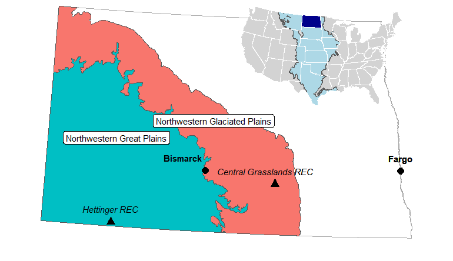
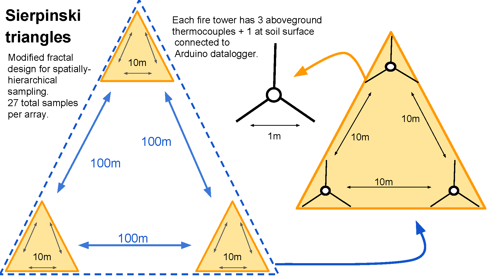

```{r setup, echo=FALSE, warning=FALSE, message = FALSE, results='hide'}
knitr::opts_chunk$set(message = FALSE, warning=FALSE, 
                      echo=FALSE, eval=FALSE)
```

# Study locations 

```{r eval = TRUE, out.width='100%', fig.align='center', fig.cap='Main map: Study locations (triangles) within two EPA level 3 ecoregions in North Dakota. Inset: State of North Dakota (dark blue) within the Great Plains (light blue) with respect to the continental United States. \\label{fig:map}'}

```
\clearpage

# Data collection 

For even more information about the FeatherFlame datalogger system, please see: 

* McGranahan DA (2021) FeatherFlame: An Arduino-based thermocouple datalogging system to record wildland fire flame temperatures \emph{in agris}. Rangeland Ecology \& Management 76, 43–47 [DOI: 10.1016/j.rama.2021.01.008](https://doi.org/10.1016/j.rama.2021.01.008)

* [diyfirescience.info](https://diyfirescience.info)

```{r scheme, eval=TRUE, out.width='100%', fig.align='center', fig.cap='Schematic representation of the Sierpinski Triangle used to deploy 27 thermocouples across 9, 1 m equilateral triangles. Total plot area = 0.433 ha. \\label{fig:triangle}'}

```

Simard et al. (1982) describe how rate of spread $r$ through an equilateral triangle with sides of length $D$ can be determined from the arrival times of the flame front at each point in the triangle sequentially\textemdash $t_1$, $t_2$, and $t_3$. 

If $t_1 \neq t_2$,
 
\begin{equation} \label{eq:simard1}
\theta = tan\textsuperscript{-1} \left( \dfrac{2t_3 - t_2 - t_1}{\sqrt{3}\cdot (t_2 - t_1)}\right) 
\end{equation}

and rate of spread $r$ is 

\begin{equation} \label{eq:simard2}
r = \dfrac{D\cdot cos\theta}{t_2 - t_1}
\end{equation}

otherwise, if $t_1 = t_2$, $\theta = 90$ and rate of spread $r$ is 

\begin{equation} \label{eq:simard3}
r = D (\sqrt{3}/2)/({t_3 - t_1})
\end{equation}

# Additional results 

## Fuel, weather, and fire behavior summaries

```{r results='asis', eval = TRUE}
pacman::p_load(tidyverse)
    read_csv(url('https://raw.githubusercontent.com/devanmcg/SpatialFireBehavior/main/data/AnalysisDataKY.csv')) %>% 
    select(-LAI, -JD, -MaxWindSpeed) %>%
    mutate(ros = ifelse(ros >= 10, NA, ros), 
           tHa = ifelse(tHa >=4, NA, tHa)) %>%
    # convert units 
    mutate(WindSpeed = WindSpeed * 0.28,  # km/hr to m/s
           tHa = tHa * 0.1) %>%           # t/ha to kg/m^s
    pivot_longer(cols = AirTemp:tHa, 
                 names_to = 'var', 
                 values_to = 'value') %>%
    mutate(type = case_when(
                    var %in% c('MaxC', 
                               'SoilMaxC', 
                               'ros') ~ 'Fire behavior', 
                    var %in% c('tHa',
                               'FuelMoisture') ~ 'Fuel', 
                    TRUE ~ 'Weather' ), 
           type = factor(type, levels = c('Fuel', 'Weather', 'Fire behavior')),
           var = recode(var, 
                        AirTemp = 'Air temperature ($^\\circ$C)', 
                        RH = 'Relative humidity (\\%)', 
                        dpC = 'Dew point ($^\\circ$C)', 
                        FuelMoisture = 'Total fuel moisture (\\%)', 
                        tHa = 'Fuel load (kg m$^{-2}$)',
                        MaxC = 'Flame temp ($^\\circ$C)', 
                        WindSpeed = 'Wind speed (m s$^{-1}$)', 
                        ros = 'Rate of spread (m min$^{-1}$)', 
                        VPD = 'Vapor pressure deficit',
                        SoilMaxC = 'Soil surface temp ($^\\circ$C)'), 
           location = recode(location, 
                             H = "Hettinger", 
                             CG = "Central Grasslands")) %>%
  group_by(location, type, var) %>%
    summarize(Mean = round(mean(value, na.rm = T), 1), 
              SD = round(sd(value, na.rm = T), 2),
              .groups = 'drop') %>%
  mutate(value = paste0(Mean, ' ± ', SD)) %>%
  rename(Variable = var) %>%
      select(-Mean, -SD, -type) %>%
  pivot_wider(names_from = location, 
              values_from = value) %>%
      xtable::xtable(caption = "Summary of fuel, weather, and fire behavior data collected from 25 fires in two locations in North Dakota. Fires in Hettinger were conducted in autumn, while those at Central Grasslands were conducted in spring.") %>%
      print(include.rownames=FALSE, 
            comment=FALSE, 
            sanitize.text.function=function(x){x})
```


\clearpage 

```{r example_script}
### S E T U P 
##
# Additional packages required for analysis
  pacman::p_load(tidyverse, readr, mice, broom.mixed, vegan, lubridate)
# Additional script available via GitHub
  source('https://raw.githubusercontent.com/cran/mice/master/R/mipo.R')
#
##
### D A T A   P R E P A R A T I O N
##
# Load raw data directly from GitHub
  fp = 'https://raw.githubusercontent.com/devanmcg/SpatialFireBehavior/main'
#
# Data wrangling
#
 AllData <-  
    read_csv(paste0(fp, "/data/fromMZ/CompiledData2.csv")) %>%
    filter(location != "OAK") %>%
      mutate(date = as.Date(date, format = "%m/%d/%Y"),
               L = str_remove(location, "REC"), 
               B = str_sub(block, 1,3), 
               Ps = str_replace(pasture, "[.]", ""), 
               Ps = str_sub(Ps, 1,2), 
               patch = str_replace(patch, "[.]", ""),
               y = format(date, "%y")) %>%
        unite("FireCode", c(L,B,Ps,patch,y), sep=".") %>%
    mutate(time = str_remove(MaxTempTime, "[.]+[0-9]"))%>%
    unite(timestamp, c(date, time), sep = " ") %>%
    mutate(timestamp = as.POSIXct(timestamp, format = "%Y-%m-%d %H:%M:%S")) %>%
        select(FireCode, timestamp, plot, array, TC, MaxC, 
               AirTemp, RH, dpC, WindSpeed, 
               LAI, FMC, KgHa) 
# Isolate soil surface temperature (TC 4)
  SoilTemp <-
    filter(AllData, TC == 4) %>%
      select(FireCode, plot, array, MaxC) %>%
        rename(SoilC = MaxC)
# Summarize array-level data 
  DataMeans <- 
    AllData %>%
      filter(TC %in% c('1', '2', '3')) %>% 
      select(-timestamp) %>%
      pivot_longer(cols = c(MaxC:KgHa), 
                   names_to = "var",
                   values_to = "value") %>%
      group_by(FireCode, plot, array, var) %>%
        summarize(Mean = mean(value) ) %>%
      ungroup() %>%
      pivot_wider(names_from = var, 
                  values_from = Mean) 
# Calculate Vapor Pressure Deficit
  DataMeans <- 
    DataMeans %>%
      mutate(e  = 6.11*(10^((7.5*dpC)/(237.3+dpC))), 
             es = 6.11*(10^((7.5*AirTemp)/(237.3+AirTemp))), 
             VPD = es - e) %>%
      select(-e, -es)
# Calculate rate of spread by arrival time of flame front at sensors 
  D = 1   # Distance between thermocouples (m)
  ROS <- 
    AllData %>%
      filter(TC %in% c('1', '2', '3')) %>%
      mutate(timestamp = format(timestamp, "%H:%M:%S"), 
             ArrivalTime = seconds(hms(timestamp)) ) %>%
    select(FireCode, plot, array, ArrivalTime) %>%
    group_by(FireCode, plot, array) %>%
    arrange(ArrivalTime, .by_group = TRUE) %>% 
    mutate(position = order(order(ArrivalTime, decreasing=FALSE)), 
           position = recode(position, "1"="a", "2"="b", "3"="c"), 
           ArrivalTime = as.numeric(ArrivalTime) /60 ) %>% # converts to m/min!
    spread(position, ArrivalTime)  %>%
    ungroup %>% 
    # Apply equations from Simard et al. (1984)
    mutate( theta_rad = atan((2*c - b - a) / (sqrt(3)*(b - a))), 
            ros = case_when(
              a == b ~ (sqrt(3) / 2) / (c - a) , 
              a != b ~  (D*cos(theta_rad) / (b - a) ) 
            )) %>%
    select(-a, -b, -c, -theta_rad)
#
# Create final tibble for analysis 
#
  AnalysisData  <- 
    full_join(DataMeans, ROS) %>%
              left_join(SoilTemp) %>%
      filter( ros <= 40,       # remove outliers
              MaxC >= 40) %>%  # ditto
      rename(FuelMoisture = FMC, 
             SoilMaxC = SoilC) %>%
        mutate(FuelMoisture = ifelse(FuelMoisture >= 0, 
                                      FuelMoisture, NA), 
               FuelMoisture = FuelMoisture * 100) %>%
      separate(FireCode, into = c("location", "block", "pasture", 
                           "patch", "year"), 
               remove = F)
#
# Imputing missing values with mice package
#
  # Calculate imputed datasets on scaled data
    imp_sc <- AnalysisData %>% 
            select(-LAI, -JD) %>%
            mutate(ros = ifelse(ros >= 12, NA, ros),    # remove outliers
                   tHa = ifelse(tHa >= 4, NA, tHa)) %>% # ditto
            mutate_at(vars(AirTemp:tHa), ~as.numeric(scale(., center=F))) %>%
                      mutate(across(location:array, as.factor)) %>%
                       mice(m=50, seed = 23109, print=F)
#
##
###  S T A T I S T I C A L   M O D E L S
##
#
# Mixed-effect regression models on imputed datasets
#
# Rate of spread
#   
  # Fit model 
    ros_RH <- 
      with(imp_sc, suppressMessages(
            lme4::glmer(ros ~ RH + tHa +
                              FuelMoisture + WindSpeed +
                              (1|location/block/year/plot), 
                        family=Gamma(link = "log"), 
                        control=lme4::glmerControl(optimizer="bobyqa", 
                                      optCtrl=list(maxfun=100000)) )) )
  # Get terms
    ros_terms <- 
      full_join(
      summary(pool(ros_RH)) %>% 
        as_tibble() %>%
        rownames_to_column("row"), 
      confint.mipo(pool(ros_RH)) %>%
        as_tibble() %>%
        rownames_to_column("row") ) 
#    
# Maximum canopy temperature  
#
  # Fit model
    canopy_RH <- 
      with(imp_sc, suppressMessages(
            lme4::glmer(MaxC ~ RH + tHa +
                            FuelMoisture + WindSpeed +
                          (1|location/block/year/plot), 
                        family=Gamma(link = "log"), 
                        control=lme4::glmerControl(optimizer="bobyqa", 
                                      optCtrl=list(maxfun=100000)) )) )
  # Get terms
    canopy_terms <- 
      full_join(
        summary(pool(canopy_RH)) %>% 
          as_tibble() %>%
          rownames_to_column("row"), 
        confint.mipo(pool(canopy_RH)) %>%
          as_tibble() %>%
          rownames_to_column("row") ) 
#
# Maximum soil surface temperature  
#
  # Fit model 
    soil_RH <- 
      with(imp_sc, suppressMessages(
            lme4::glmer(log(SoilMaxC+1) ~ RH + tHa +
                        FuelMoisture + WindSpeed +
                        (1|location/block/year/plot), 
              family=Gamma(link = "log"), 
              control=lme4::glmerControl(optimizer="bobyqa", 
                            optCtrl=list(maxfun=100000)) )) )
  # Get terms
    soil_terms <- 
      full_join(
        summary(pool(soil_RH)) %>% 
          as_tibble() %>%
          rownames_to_column("row"), 
        confint.mipo(pool(soil_RH)) %>%
          as_tibble() %>%
          rownames_to_column("row") ) 
#
# Multivariate analysis
#
  # Reduce mids object to tibble   
    imp_raw <- 
      complete(imp_sc, 'long') %>%
      as_tibble() %>%
      unite("TreeID", c(location, block, pasture,
                        year, plot, array), sep = ".") %>%
      select(-patch, -.id, -.imp, -FireCode) %>%
      pivot_longer(names_to = "response", 
                   values_to = "values", 
                   -TreeID) %>%
      group_by(TreeID, response) %>%
      summarize(value = median(values)) %>%
      ungroup() %>%
      pivot_wider(names_from = response, 
                  values_from = value) %>%
      separate(TreeID, c("location", "block", "pasture",
                         "year", "plot", "array")) %>% 
      mutate(across(location:array, as.factor))
  # Fire behavior PCA 
    fb_d <- 
      imp_raw %>%
      select(MaxC, ros, SoilMaxC) 
    fb_pca <- rda(fb_d ~ 1, 'euc', scale = T)
  # Test differences between locations 
    envfit(fb_pca ~ location, imp_raw, 
           choices = c(1:2), 
           strata = imp_raw$year, 
           199)$factors
# Test fire weather against PCA
   envfit(fb_pca ~ MaxWindSpeed+AirTemp+dpC+RH+VPD, 
          data = imp_raw, 
          choices = c(1:3), 
          strata = imp_raw$location)
```


# Script 

```{r script, ref.label=knitr::all_labels(label %in% c('example_script') ), echo=TRUE, eval=FALSE}
```    