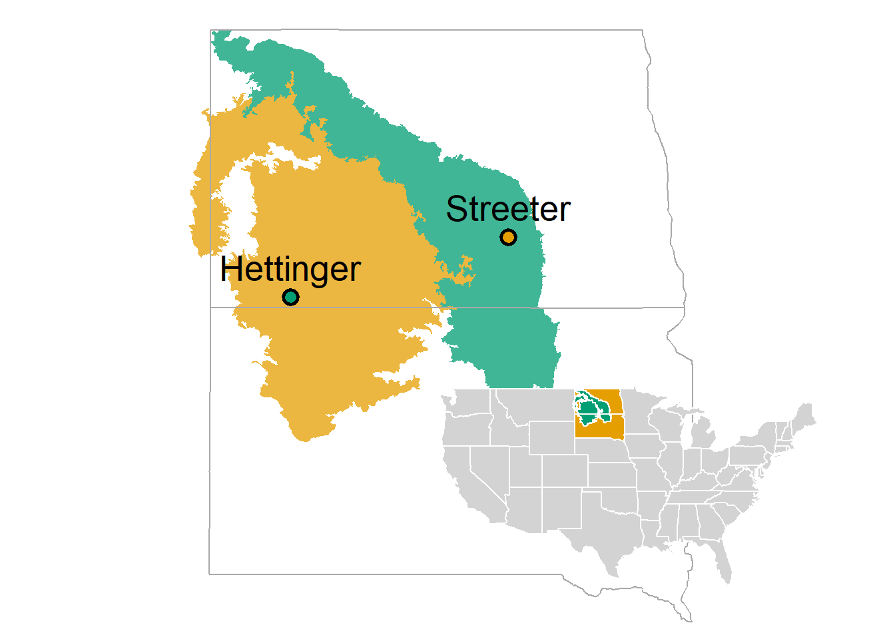

```{r setup, echo=FALSE, warning=FALSE, message = FALSE, results='hide'}
knitr::opts_chunk$set(message = FALSE, warning=FALSE, 
               echo=FALSE, eval=TRUE, fig.path='figures/', dev=c('png', 'pdf')) 
FilePath = "C:/Users/devan/GitHubProjects/SpatialFireBehavior"
AnalysisData <- readr::read_csv(paste0(FilePath, "/data/AnalysisDataKY.csv"))
load(paste0(FilePath, '/r objects/response_CIs.Rdata'))
load(paste0(FilePath, '/r objects/imp_raw.Rdata'))
load(paste0(FilePath, '/r objects/pca_ev.Rdata'))
source(paste0(FilePath, '/r script/CustomThemes.R'))
source("https://raw.githubusercontent.com/devanmcg/IntroRangeR/master/11_IntroMultivariate/ordinationsGGplot.R")
```

```{r}
# Packages
  pacman::p_load(tidyverse, mice, lubridate, gridExtra, vegan)
```

# Methods 

## Study locations



## Analysis

### Data & Distributions 

The raw weather, fuels, and fire behavior data used here are available in [CSV format](https://github.com/devanmcg/SpatialFireBehavior/raw/main/data/fromMZ/CompiledData2.csv).  

```{r data_prep, eval=FALSE}
###
# Note: Data prep steps included for reference. 
# Data used in analysis, AnalysisDataKY.csv, has been modified outside of
# this script to update missing data from another spreadsheet. 
 AllData <-  
    read_csv(paste0(FilePath, "/data/fromMZ/CompiledData2.csv")) %>%
    filter(location != "OAK") %>%
      mutate(date = as.Date(date, format = "%m/%d/%Y"),
               L = str_remove(location, "REC"), 
               B = str_sub(block, 1,3), 
               Ps = str_replace(pasture, "[.]", ""), 
               Ps = str_sub(Ps, 1,2), 
               patch = str_replace(patch, "[.]", ""),
               y = format(date, "%y")) %>%
        unite("FireCode", c(L,B,Ps,patch,y), sep=".") %>%
    mutate(time = str_remove(MaxTempTime, "[.]+[0-9]"))%>%
    unite(timestamp, c(date, time), sep = " ") %>%
    mutate(timestamp = as.POSIXct(timestamp, format = "%Y-%m-%d %H:%M:%S")) %>%
        select(FireCode, timestamp, plot, array, TC, MaxC, 
               AirTemp, RH, dpC, MaxWindSpeed, 
               LAI, FMC, KgHa) 

# Isolate soil surface temperature (TC 4)
  SoilTemp <-
    filter(AllData, TC == 4) %>%
      select(FireCode, plot, array, MaxC) %>%
        rename(SoilC = MaxC)
  
# Summarize array-level data 
  DataMeans <- 
    AllData %>%
      filter(TC %in% c('1', '2', '3')) %>% 
      select(-timestamp) %>%
      pivot_longer(cols = c(MaxC:KgHa), 
                   names_to = "var",
                   values_to = "value") %>%
      group_by(FireCode, plot, array, var) %>%
        summarize(Mean = mean(value) ) %>%
      ungroup() %>%
      pivot_wider(names_from = var, 
                  values_from = Mean) 

# Calculate Vapor Pressure Deficit
  DataMeans <- 
    DataMeans %>%
      mutate(e  = 6.11*(10^((7.5*dpC)/(237.3+dpC))), 
             es = 6.11*(10^((7.5*AirTemp)/(237.3+AirTemp))), 
             VPD = es - e) %>%
      select(-e, -es)
  
# Calculate ROS 
  D = 1   # Distance between thermocouples (m)
  ROS <- 
    AllData %>%
      filter(TC %in% c('1', '2', '3')) %>%
      mutate(timestamp = format(timestamp, "%H:%M:%S"), 
             ArrivalTime = seconds(hms(timestamp)) ) %>%
    select(FireCode, plot, array, ArrivalTime) %>%
    group_by(FireCode, plot, array) %>%
    arrange(ArrivalTime, .by_group = TRUE) %>% 
    mutate(position = order(order(ArrivalTime, decreasing=FALSE)), 
           position = recode(position, "1"="a", "2"="b", "3"="c"), 
           ArrivalTime = as.numeric(ArrivalTime) /60 ) %>%
    spread(position, ArrivalTime)  %>%
    ungroup %>% 
    mutate( theta_rad = atan((2*c - b - a) / (sqrt(3)*(b - a))), 
            ros = case_when(
              a == b ~ (sqrt(3) / 2) / (c - a) , 
              a != b ~  (D*cos(theta_rad) / (b - a) ) 
            )) %>%
    select(-a, -b, -c, -theta_rad)
  
# Combine, filter into final tibble for analysis 
  AnalysisData  <- 
    full_join(DataMeans, ROS) %>%
              left_join(SoilTemp) %>%
      filter( ros <= 40, 
              MaxC >= 40) %>%
      rename(FuelMoisture = FMC, 
             SoilMaxC = SoilC) %>%
        mutate(FuelMoisture = ifelse(FuelMoisture >= 0, 
                                      FuelMoisture, NA), 
               FuelMoisture = FuelMoisture * 100) %>%
      separate(FireCode, into = c("location", "block", "pasture", 
                           "patch", "year"), 
               remove = F)
###
```

```{r fig.width = 10, fig.height = 8, fig.cap="A scatterplot matrix of all raw data used in this analysis."}
# Scatterplot matrix  
AnalysisData %>%
  select(-LAI) %>%
  GGally::ggpairs(columns = 9:18, 
                  upper = 'blank')
```

```{r dist_gg, fig.width = 8, fig.height =8, fig.cap = "Gamma distributions are fit to all response variables. Two outliers above 600 deg C were removed from analysis on soil maximum temperature."}
# Distributions of response variables
  ros_dist <-
  AnalysisData %>% 
    ggplot(aes(x=ros)) + theme_bw(14) + 
    geom_histogram(aes(y=..density..),      
                   binwidth=0.5,
                   colour="black", 
                   fill="lightgreen") +
    geom_density(alpha=0.2, 
                 fill="#FF6666") 
  tempC_dist <- 
  AnalysisData %>% 
    ggplot(aes(x=MaxC)) + theme_bw(14) + 
    geom_histogram(aes(y=..density..),      
                   binwidth=10,
                   colour="black", 
                   fill="lightgreen") +
    geom_density(alpha=0.2, 
                 fill="#FF6666") 
  soilC_dist <- 
  AnalysisData %>% 
  ggplot(aes(x=SoilMaxC)) + theme_bw(14) + 
  geom_histogram(aes(y=..density..),      
                 binwidth=10,
                 colour="black", 
                 fill="lightgreen") +
  geom_density(alpha=0.2, 
               fill="#FF6666") 
  gridExtra::grid.arrange(tempC_dist, soilC_dist, 
                          ros_dist, ncol=2)
```

### Regression analysis

For analysis, are filtered to $\textsf{Rate of spread < 40 m/s}$ and $\textsf{Maximum temperature > 40}^\circ \textsf{C}$.

**Imputation of missing values**

There are several missing values in the data:

```{r missing_table}
# MICE operations 
#
# Pattern of missing data
AnalysisData %>%
  select(-FireCode, -location, -block, -pasture,-patch,
         -year, -plot, -array) %>%
    mice::md.pattern(plot = F) %>%
  pander::pander(caption="Table of missing values by variable.") 
```

Therefore I used the multiple imputation method in the **mice** package to fill in missing values. 
The method creates 500 datasets, each with different but reasonable values for the missing data based on patterns in existing data, and performs the regression analysis on each. 
These results are pooled into a single set of results. 

```{r imp, eval=FALSE}
# Calculate imputed datasets
  imp <- AnalysisData %>% 
          select(-LAI) %>%
              mutate(across(plot:array, ~as.character(.))) %>%
               mice(m=500, seed = 23109, print=F)

# Return completed datset   
  imp_raw <- 
    complete(imp) %>%
            as_tibble() %>% 
              mutate(across(location:array, as.factor))
    
# Scale response variables for regression analysis   
  imp_sc <- 
    imp_raw %>%
     mutate_at(vars(AirTemp:tHa), ~as.numeric(scale(., center=F)))
```

**Model specification** 

Mixed-effect regression models fit with `glmmADMB::glmmadmb` and constructed as follows: 

$$y \approx RH + WS + FM + FL + (1|location/year/plot),~ 
\text{family = gamma, link = log}$$

where 

$RH$ = Relative humidity,

$WS$ = Average wind speed, 

$FM$ = Fuel moisture (from clipped samples), 

$FL$ = Fuel load (t/ha from clipped samples)

Weather variables $RH$ and $WS$ were taken from NDAWN stations for the hour in which the fire behavior observation occurred. 

All variables were scaled to a common range prior to analysis, and units for each predictor variable are not reported. 

Response variables included

* Maximum temperature (C) 15 cm above soil surface (mean of three thermocouples)
* Maximum temperature (C) at soil surface (single thermocouple)
* Rate of spread (m/s) through three points of a 1 m equilateral triangle

Thermocouple data recorded with the open-source [FeatherFlame](https://diyfirescience.info/portfolio/work2/) system. 

### Multivariate analysis 

Principal Components Analysis (PCA) on fire behavior responses fit with `vegan::rda`. 
Post-hoc group (location) and gradient (fire weather) analysis with `vegan::envfit`. 

An additional composite variable, vapor pressure deficit (VPD), was calculated as  

$\text{VPD} = e - e_s$ 

where 

$e = 6.11 \cdot 10^{\frac{7.5 \cdot \text{Dewpoint}}{237.3 + \text{Dewpoint}}}$ 

and 

$e_s = 6.11 \cdot 10^{\frac{7.5 \cdot \text{Air temperature}}{237.3 + \text{Air temperature}}}$


```{r ADMB_mods, eval=FALSE}
# Max soil surface temperature 
  # Fit model
    soil_ADMB <- glmmADMB::glmmadmb(SoilMaxC ~ RH + MaxWindSpeed +
                            FuelMoisture + tHa,
                          random = ~ 1|location/year/plot ,
                          data=filter(imp_sc, SoilMaxC <= 3.9),
                          family="gamma",
                          link="log",  
                          admb.opts=glmmADMB::admbControl(shess = TRUE, 
                                                          noinit = TRUE, 
                                                          impSamp = 10) )
  # Retrieve regression results
    soil_terms <-   
      confint(soil_ADMB) %>%
      as.data.frame %>%
      rownames_to_column("term") %>%
      rename(lwr = `2.5 %`, upr = `97.5 %`) %>%
      full_join(
        coef(soil_ADMB) %>%
          as.data.frame() %>% 
          rownames_to_column("term") %>%
          rename(estimate = '.') )

# Maximum aboveground temp (plant canopy)  
  # Fit model
    canopy_ADMB <- glmmADMB::glmmadmb(MaxC ~ RH + MaxWindSpeed +
                                        FuelMoisture + tHa,
                          random = ~ 1|location/year/plot ,
                          data=imp_sc,
                          family="gamma",
                          link="log",  
                          admb.opts=glmmADMB::admbControl(shess = TRUE, 
                                                          noinit = TRUE, 
                                                          impSamp = 10))
  # Retrieve regression results
  canopy_terms <-   
    confint(canopy_ADMB) %>%
    as.data.frame %>%
    rownames_to_column("term") %>%
    rename(lwr = `2.5 %`, upr = `97.5 %`) %>%
    full_join(
      coef(canopy_ADMB) %>%
        as.data.frame() %>% 
        rownames_to_column("term") %>%
        rename(estimate = '.') )
  
# Rate of spread 
  # Fit model 
    ros_ADMB <- glmmADMB::glmmadmb(ros ~ RH + MaxWindSpeed +
                                    FuelMoisture + tHa,
                          random = ~ 1|location/year/plot ,
                          data=imp_sc,
                          family="gamma",
                          link="log",  
                          admb.opts=glmmADMB::admbControl(shess = TRUE, 
                                                          noinit = TRUE, 
                                                          impSamp = 10))
  # Retrieve regression results  
    ros_terms <-   
      confint(ros_ADMB) %>%
      as.data.frame %>%
      rownames_to_column("term") %>%
      rename(lwr = `2.5 %`, upr = `97.5 %`) %>%
      full_join(
        coef(ros_ADMB) %>%
          as.data.frame() %>% 
          rownames_to_column("term") %>%
          rename(estimate = '.') )

# Compile results 
    
    response_CIs <-   
      bind_rows(
        mutate(soil_terms, response = 'Temp. at surface'), 
        mutate(canopy_terms, response = 'Temp. above surface'),
        mutate(ros_terms, response = "Rate of spread") 
      ) %>%
      as_tibble()
```

# Results 

## Fuel, weather, and fire behavior across locations 

```{r data_summary_gg, fig.height=10, fig.width=6}
LongData <- 
  AnalysisData %>%
    select(-LAI) %>%
    pivot_longer(cols = AirTemp:tHa, 
                 names_to = 'var', 
                 values_to = 'value') %>%
    mutate(type = case_when(
                    var %in% c('MaxC', 
                               'SoilMaxC', 
                               'ros') ~ 'Fire behavior', 
                    var %in% c('tHa',
                               'FuelMoisture') ~ 'Fuel', 
                    TRUE ~ 'Weather' ), 
           var = recode(var, 
                        AirTemp = 'Air temperature (C)', 
                        RH = 'Relative humidity (%)', 
                        dpC = 'Dew point (C)', 
                        FuelMoisture = 'Fuel moisture (%)', 
                        tHa = 'Fuel load (t/ha)',
                        MaxC = 'Flame temp (C)', 
                        MaxWindSpeed = 'Wind speed (m/s)', 
                        ros = 'Rate of spread (m/s)', 
                        SoilMaxC = 'Surface soil temp (C)'), 
           location = recode(location, 
                             H = "Hettinger", 
                             CG = "Central Grasslands"))

wx_d <-
LongData %>%
  filter(type == "Weather") %>%
  ggplot(aes(x = location, y= value,
             fill = location)) + theme_bw(14) +
    geom_violin() +
  labs(y = NULL, x = NULL, 
       title = "Weather") + 
  facet_wrap( ~ var, scales = 'free') +
  scale_fill_manual(values = cbPal5[1:2]) + 
  theme(axis.text.x = element_blank(), 
        panel.grid.major.x = element_blank(), 
        legend.position = "none")

fuel_d <-
LongData %>%
  filter(type == "Fuel") %>%
  ggplot(aes(x = location, y= value,
             fill = location)) + theme_bw(14) +
    geom_violin() +
  labs(y = NULL, x = NULL, 
       title = "Fuel") + 
  facet_wrap( ~ var, scales = 'free') +
  scale_fill_manual(values = cbPal5[1:2]) + 
  theme(axis.text.x = element_blank(), 
        panel.grid.major.x = element_blank(), 
        legend.position = "none")

fb_d <-
  LongData %>%
    filter(type == "Fire behavior", 
           value <= 600) %>%
    ggplot(aes(x = location, y= value,
               fill = location)) + theme_bw(14) +
      geom_violin() +
    labs(y = NULL, x = NULL, 
         title = "Fire behavior") + 
    facet_wrap( ~ var, scales = 'free') +
    scale_fill_manual(values = cbPal5[1:2]) + 
    theme(axis.text.x = element_blank(), 
          panel.grid.major.x = element_blank(), 
          legend.position = "bottom")

# Create list of panels
  gl <- lst(wx_d, fuel_d, fb_d)
  
  grid.arrange(
    grobs = gl,
    widths = c(1),
    heights = c(0.35, 0.25, 0.35)  )
```

## Variables associated with fire behavior

**Rate of spread** significantly increased with windspeed ($z = 3.24, P < 0.01$) and decreased with greater fuel moisture content ($z = -5.84, P < 0.001$). 
**Aboveground temperatures** in the plant canopy were lower with greater fuel moisture content ($z = -6.45, P < 0.001$) and increased with fuel load ($z = 5.49, P < 0.001$) and wind speed ($z = 2.82, P < 0.01$).
**Temperature at the soil surface** had a statistically-significant inverse relationship with relative humidity ($z = -2.52, P = 0.01$) and fuel moisture ($z = -3.22, P < 0.01$), which likely indicates higher-intensity fires that burn down through litter. 

```{r CI_gg, fig.width=8, fig.height = 3.75}
# Plot confidence intervals
response_CIs %>%
  filter(term != '(Intercept)') %>%
  as_tibble() %>%
  mutate(term = recode(term, tHa = 'Fuel load', 
                             MaxWindSpeed = 'Wind speed', 
                             RH = 'Relative humidity', 
                             FuelMoisture = 'Fuel moisture'))  %>%
  ggplot(aes(x = reorder(term, abs(estimate), max))) + theme_bw(16) + 
    geom_hline(yintercept = 0, color="black", linetype = 2) +
    geom_errorbar(aes(ymin = lwr, ymax = upr), 
                  size = 1.1, width = 0.2, 
                  color = "blue") +
    geom_point(aes(y = estimate), pch = 21, 
               stroke = 1.5, size = 4,
               color = "blue", fill="lightblue") +
    labs(x = '', 
         y = 'Regression coefficient with 95% CI') + 
    coord_flip(ylim=c(-1.5,2.4)) + 
    facet_wrap(~ response) + 
    theme(axis.text.y = element_text(color="black", size = 14), 
          strip.text = element_text(size = 14), 
          panel.grid.major.y = element_blank())
```  

## Multivariate analysis 

```{r fit_pca}
# Fire behavior PCA 
  fb_d <- 
    imp_raw %>%
    select(MaxC, ros, SoilMaxC) 
  
  fb_pca <- rda(fb_d ~ 1, 'euc', scale = T)
```

```{r pca_eig}
 summary(fb_pca)$cont$importance %>% pander::pander("Eigenvalues and proportion explained by composite axes (principal components).")
```
  
```{r}
# Testing for differences between locations 
  envfit(fb_pca ~ location, imp_raw, 
         choices = c(1:3), 
         strata = imp_raw$year, 
         199)$factors
```

No difference in fire behavior patterns between Hettinger and Central Grasslands; this is expected.

```{r envfit, eval=FALSE}
# Testing fire weather against PCA
 envfit(fb_pca ~ MaxWindSpeed + AirTemp + dpC + RH + VPD, 
         data = imp_raw, 
         choices = c(1:3), 
         strata = imp_raw$location)
```

```{r echo=FALSE}
pca_ev
```

RH and VPD had statistically-significant associations with variation in fire behavior, but even these relationships were weak. 

```{r pca_dat}  
  # get ord data for ggplotting
  pca_gg <- gg_ordiplot(fb_pca, groups = imp_raw$location, 
                        plot=FALSE)
  
  pca_spp <- # species only; sites come later
    scores(fb_pca, display = "species") %>%
    as.data.frame %>%
    as_tibble(rownames="response")
  
  # Vector 
  pca_vd <- scores(pca_ev,  "vectors") %>%
                as.data.frame %>% 
                rownames_to_column("gradient") %>%
              filter(gradient %in% c("RH", "VPD")) %>%
              select(-PC3) %>%
            as_tibble( ) 
  
  pca_scores <- lst(species=pca_spp, 
                    vectors=pca_vd)
  pca_scores$spiders <-
    pca_gg$df_spiders %>% 
    rename(PC1 = x, PC2 = y) %>%
    as_tibble()
```

```{r pca_gg, fig.height=4, fig.width=6, fig.cap='Principal Components Analysis of fire behavior data (response variables in red) for prescribed burns on rangeland at Hettinger (H) and Central Grasslands  (CG) Research Extension Centers. No difference between locations and only the vapor pressure deficit (VPD) and relative humidty (RH) gradients had significant associations with variation in fire behavior.' }
# ggplot PCA
  ggplot() + theme_bw(16) + 
    labs(x="PC 1", 
         y="PC 2") + 
    geom_vline(xintercept = 0, lty=3, color="darkgrey") +
    geom_hline(yintercept = 0, lty=3, color="darkgrey") +
    geom_point(data=pca_scores$spiders, 
                        aes(x=PC1, y=PC2, 
                            shape=Group, 
                            colour=Group), 
                        size=2)  +   
    geom_segment(data=pca_scores$spiders, 
                 aes(x=cntr.x, y=cntr.y,
                     xend=PC1, yend=PC2, 
                     color=Group), 
                 size=1.2, 
                 alpha = 0.75) +
    geom_point(data=pca_scores$spiders, 
               aes(x=PC1, y=PC2, fill=Group), 
               colour="grey40", 
               pch=21, 
               size=3, 
               stroke=2, alpha = 0.75) +
    geom_segment(data=pca_scores$vectors, 
                 aes(x=0, y=0, 
                     xend=PC1*1.6, 
                     yend=PC2*1.6),
                 arrow=arrow(length = unit(0.03, "npc")),
                 lwd=1.5) +
  geom_label(data=pca_scores$spiders,
               aes(x=cntr.x,
                   y=cntr.y,
                   label=Group,
                   color=Group),
               fontface="bold", size=4,
               label.size = 0,
               label.r = unit(0.5, "lines")) +
    geom_text(data=pca_scores$vectors,
              aes(x=PC1*1.75, 
                  y=PC2*1.75, 
                  label=gradient), 
              nudge_x = 0.06, 
              nudge_y =-0.05, 
              size=6, fontface="bold") + 
    geom_label(data=pca_scores$species, 
                aes(x=PC1/3, 
                    y=PC2/3, 
                    label=response), 
                label.padding=unit(0.25,"lines"),
                label.size = 0.5, 
                fontface="bold", 
               color="darkred") +
    scale_color_manual(values = cbPal5[1:2]) + 
    scale_fill_manual(values = cbPal5[1:2])  +
    theme(panel.grid=element_blank(), 
          legend.position="none") 

```


It is interesting that the gradient in temperature at the soil surface (SoilMaxC) is orthogonal to both canopy temperature and rate of spread (MaxC and ros, respectively). 
This confirms trends observed in the regression analysis that the conditions most conducive to fast, high-intensity fires are not the same that result in surface heating. 

Managers might be able to use high windspeeds to mitigate soil heating when fuels are dry, or focus on conditions with low RH to ensure litter burns down to the soil surface. 

# Script

```{r script, ref.label=knitr::all_labels(!label %in% c('setup', 'dist_gg', 'data_summary_gg', 'CI_gg', 'pca_eig', 'pca_dat', 'pca_gg') ), echo=TRUE, eval=FALSE}
```    