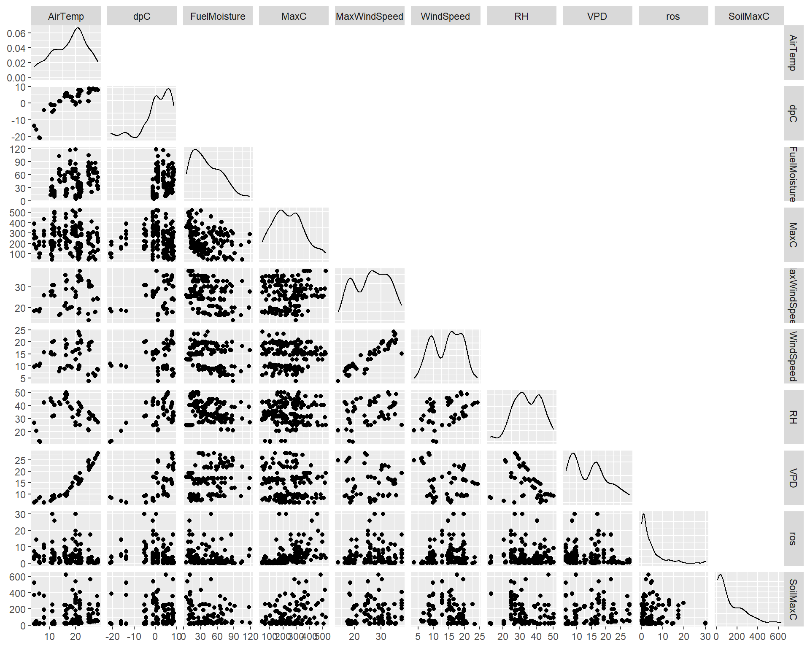
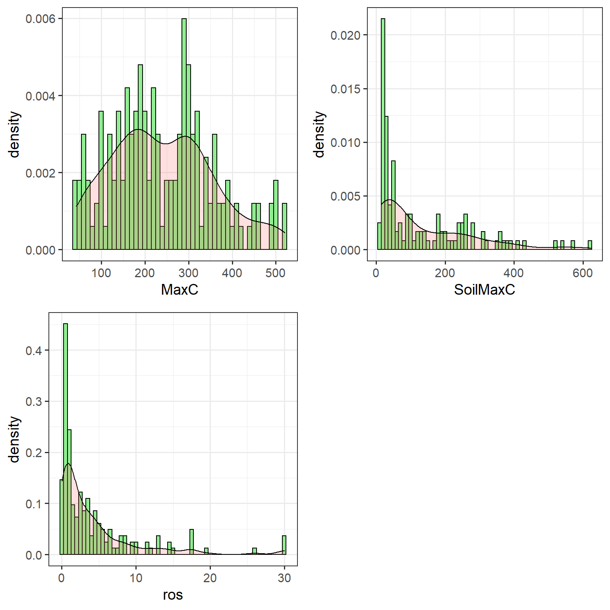
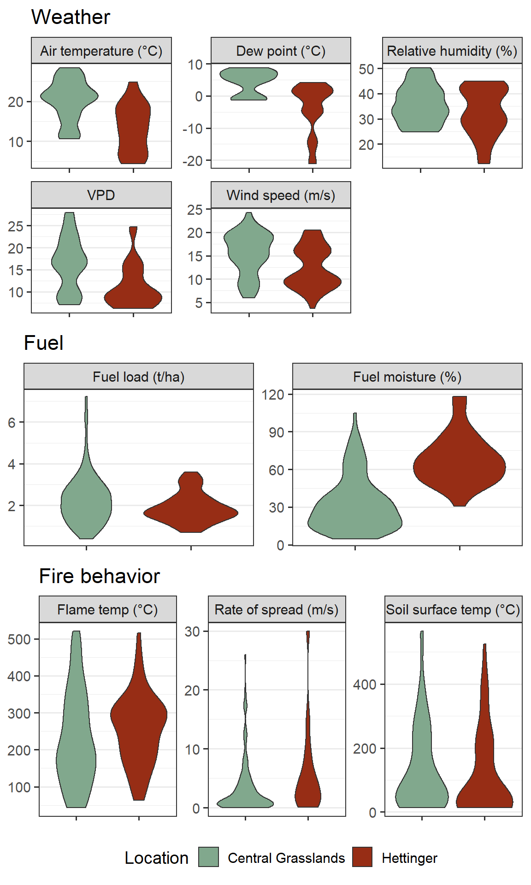
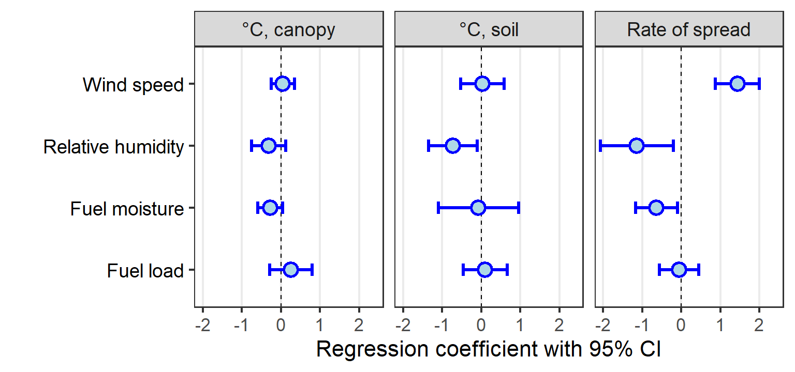

# Methods 

## Study locations


## Analysis

### Data & Distributions 

The raw weather, fuels, and fire behavior data used here are available in [CSV format](https://github.com/devanmcg/SpatialFireBehavior/raw/main/data/fromMZ/CompiledData2.csv).  






### Regression analysis

For analysis, are filtered to $\textsf{Rate of spread < 40 m/s}$ and $\textsf{Maximum temperature > 40}^\circ \textsf{C}$.

**Imputation of missing values**

There are several missing values in the data:


---------------------------------------------------------------------------
 &nbsp;   MaxC   ros   AirTemp   dpC   MaxWindSpeed   RH   VPD   LAI   tHa 
-------- ------ ----- --------- ----- -------------- ---- ----- ----- -----
 **81**    1      1       1       1         1         1     1     1     1  

 **26**    1      1       1       1         1         1     1     1     1  

 **1**     1      1       1       1         1         1     1     1     1  

 **33**    1      1       1       1         1         1     1     1     0  

 **4**     1      1       1       1         1         1     1     0     1  

 **13**    1      1       1       1         1         1     1     0     1  

 **1**     1      1       0       0         0         0     0     1     1  

           0      0       1       1         1         1     1    17    33  
---------------------------------------------------------------------------

Table: Table of missing values by variable. (continued below)

 
-------------------------------------------
 &nbsp;   FuelMoisture   SoilMaxC   &nbsp; 
-------- -------------- ---------- --------
 **81**        1            1         0    

 **26**        1            0         1    

 **1**         0            1         1    

 **33**        0            1         2    

 **4**         1            1         1    

 **13**        1            0         2    

 **1**         1            0         6    

               34           40       129   
-------------------------------------------

Therefore I used the multiple imputation method in the **mice** package to fill in missing values. 
The method creates 100 datasets, each with different but reasonable values for the missing data based on patterns in existing data, and performs the regression analysis on each. 
These results are pooled into a single set of results. 

**Model specification** 

Mixed-effect regression models fit with `glmmADMB::glmmadmb` and constructed as follows: 

$$y \approx RH + WS + FM + FL + (1|location/year/plot),~ 
\text{family = gamma, link = log}$$

where 

$RH$ = Relative humidity,

$WS$ = Average wind speed, 

$FM$ = Fuel moisture (from clipped samples), 

$FL$ = Fuel load (t/ha from clipped samples)

Weather variables $RH$ and $WS$ were taken from NDAWN stations for the hour in which the fire behavior observation occurred. 

All variables were scaled to a common range prior to analysis, and units for each predictor variable are not reported. 

Response variables included

* Maximum temperature (C) 15 cm above soil surface (mean of three thermocouples)
* Maximum temperature (C) at soil surface (single thermocouple)
* Rate of spread (m/s) through three points of a 1 m equilateral triangle

Thermocouple data recorded with the open-source [FeatherFlame](https://diyfirescience.info/portfolio/work2/) system. 

### Multivariate analysis 

Principal Components Analysis (PCA) on fire behavior responses fit with `vegan::rda`. 
Post-hoc group (location) and gradient (fire weather) analysis with `vegan::envfit`. 

An additional composite variable, vapor pressure deficit (VPD), was calculated as  

$\text{VPD} = e - e_s$ 

where 

$e = 6.11 \cdot 10^{\frac{7.5 \cdot \text{Dewpoint}}{237.3 + \text{Dewpoint}}}$ 

and 

$e_s = 6.11 \cdot 10^{\frac{7.5 \cdot \text{Air temperature}}{237.3 + \text{Air temperature}}}$


# Results 

## Fuel, weather, and fire behavior across locations 

<!-- -->

## Variables associated with fire behavior

**Rate of spread** significantly increased with windspeed ($z = 2.61, P = 0.01$) and decreased with greater fuel moisture content ($z = -3.92, P < 0.001$). 
**Aboveground temperatures** in the plant canopy were lower with greater fuel moisture content ($z = -5.48, P < 0.001$) and increased with fuel load ($z = 5.16, P < 0.001$) and wind speed ($z = 2.10, P = 0.04$).
**Temperature at the soil surface** had a statistically-significant inverse relationship with relative humidity ($z = -2.77, P < 0.01$), which likely indicates higher intensity fires that burn down through litter. 
There was a marginally-significant trend for higher fuel moisture to reduce temperature at the soil surface, as well ($z = -1.85, P = 0.06$). 

Further work should include quantifying total heat exposure via infrared sensors. 

<!-- -->

## Multivariate analysis 


------------------------------------------------------
          &nbsp;              PC1      PC2      PC3   
--------------------------- -------- -------- --------
      **Eigenvalue**         1.466    1.005    0.5293 

 **Proportion Explained**    0.4885   0.335    0.1764 

 **Cumulative Proportion**   0.4885   0.8236     1    
------------------------------------------------------

Table: Eigenvalues and proportion explained by composite axes (principal components).
  

```
## Centroids:
##                PC1     PC2     PC3
## locationCG  0.0494  0.0219 -0.0268
## locationH  -0.0884 -0.0392  0.0479
## 
## Goodness of fit:
##              r2 Pr(>r)
## location 0.0159   0.28
## Blocks:  strata 
## Permutation: free
## Number of permutations: 199
```

No difference in fire behavior patterns between Hettinger and Central Grasslands. 


```
## 
## ***VECTORS
## 
##                   PC1      PC2      PC3     r2 Pr(>r)  
## MaxWindSpeed -0.39819 -0.91203 -0.09828 0.0371  0.220  
## AirTemp       0.67369  0.73680 -0.05716 0.0501  0.120  
## dpC           0.85452  0.31466 -0.41326 0.0454  0.198  
## RH            0.45397 -0.59072 -0.66705 0.0518  0.061 .
## VPD           0.47988  0.87315  0.08556 0.0554  0.061 .
## ---
## Signif. codes:  0 '***' 0.001 '**' 0.01 '*' 0.05 '.' 0.1 ' ' 1
## Blocks:  strata 
## Permutation: free
## Number of permutations: 999
```

RH and VPD had a statistically-significant associations with variation in fire behavior, but even these relationships were weak. 


# Script


```r
# Packages
  pacman::p_load(tidyverse, mice, lubridate, gridExtra, vegan)
 AllData <-  
    read_csv(paste0(FilePath, "data/fromMZ/CompiledData2.csv")) %>%
    filter(location != "OAK") %>%
      mutate(date = as.Date(date, format = "%m/%d/%Y"),
               L = str_remove(location, "REC"), 
               B = str_sub(block, 1,3), 
               Ps = str_replace(pasture, "[.]", ""), 
               Ps = str_sub(Ps, 1,2), 
               patch = str_replace(patch, "[.]", ""),
               y = format(date, "%y")) %>%
        unite("FireCode", c(L,B,Ps,patch,y), sep=".") %>%
    mutate(time = str_remove(MaxTempTime, "[.]+[0-9]"))%>%
    unite(timestamp, c(date, time), sep = " ") %>%
    mutate(timestamp = as.POSIXct(timestamp, format = "%Y-%m-%d %H:%M:%S")) %>%
        select(FireCode, timestamp, plot, array, TC, MaxC, 
               AirTemp, RH, dpC, MaxWindSpeed, 
               LAI, FMC, KgHa) 

# Isolate soil surface temperature (TC 4)
  SoilTemp <-
    filter(AllData, TC == 4) %>%
      select(FireCode, plot, array, MaxC) %>%
        rename(SoilC = MaxC)
  
# Summarize array-level data 
  DataMeans <- 
    AllData %>%
      filter(TC %in% c('1', '2', '3')) %>% 
      select(-timestamp) %>%
      pivot_longer(cols = c(MaxC:KgHa), 
                   names_to = "var",
                   values_to = "value") %>%
      group_by(FireCode, plot, array, var) %>%
        summarize(Mean = mean(value) ) %>%
      ungroup() %>%
      pivot_wider(names_from = var, 
                  values_from = Mean) 

# Calculate Vapor Pressure Deficit
  DataMeans <- 
    DataMeans %>%
      mutate(e  = 6.11*(10^((7.5*dpC)/(237.3+dpC))), 
             es = 6.11*(10^((7.5*AirTemp)/(237.3+AirTemp))), 
             VPD = es - e) %>%
      select(-e, -es)
  
# Calculate ROS 
  D = 1   # Distance between thermocouples (m)
  ROS <- 
    AllData %>%
      filter(TC %in% c('1', '2', '3')) %>%
      mutate(timestamp = format(timestamp, "%H:%M:%S"), 
             ArrivalTime = seconds(hms(timestamp)) ) %>%
    select(FireCode, plot, array, ArrivalTime) %>%
    group_by(FireCode, plot, array) %>%
    arrange(ArrivalTime, .by_group = TRUE) %>% 
    mutate(position = order(order(ArrivalTime, decreasing=FALSE)), 
           position = recode(position, "1"="a", "2"="b", "3"="c"), 
           ArrivalTime = as.numeric(ArrivalTime) /60 ) %>%
    spread(position, ArrivalTime)  %>%
    ungroup %>% 
    mutate( theta_rad = atan((2*c - b - a) / (sqrt(3)*(b - a))), 
            ros = case_when(
              a == b ~ (sqrt(3) / 2) / (c - a) , 
              a != b ~  (D*cos(theta_rad) / (b - a) ) 
            )) %>%
    select(-a, -b, -c, -theta_rad)
  
# Combine, filter into final tibble for analysis 
  AnalysisData  <- 
    full_join(DataMeans, ROS) %>%
              left_join(SoilTemp) %>%
      filter( ros <= 40, 
              MaxC >= 40) %>%
      rename(FuelMoisture = FMC, 
             SoilMaxC = SoilC) %>%
        mutate(FuelMoisture = ifelse(FuelMoisture >= 0, 
                                      FuelMoisture, NA), 
               FuelMoisture = FuelMoisture * 100) %>%
      separate(FireCode, into = c("location", "block", "pasture", 
                           "patch", "year"), 
               remove = F)
# Scatterplot matrix  
  GGally::ggpairs(AnalysisData, 
                  columns = 9:18, 
                  upper = 'blank')
# MICE operations 
#
# Pattern of missing data
AnalysisData %>%
  select(-FireCode, -location, -block, -pasture,-patch,
         -year, -plot, -array) %>%
    mice::md.pattern(plot = F) %>%
  pander::pander(caption="Table of missing values by variable.") 
# Max soil surface temperature 
  # Fit model
    soil_ADMB <- glmmADMB::glmmadmb(SoilMaxC ~ RH + MaxWindSpeed +
                            FuelMoisture + tHa,
                          random = ~ 1|location/year/plot ,
                          data=filter(imp_d, SoilMaxC <= 3.0),
                          family="gamma",
                          link="log",  
                          admb.opts=glmmADMB::admbControl(shess = TRUE, 
                                                          noinit = TRUE, 
                                                          impSamp = 10) )
  # Retrieve regression results
    soil_terms <-   
      confint(soil_ADMB) %>%
      as.data.frame %>%
      rownames_to_column("term") %>%
      rename(lwr = `2.5 %`, upr = `97.5 %`) %>%
      full_join(
        coef(soil_ADMB) %>%
          as.data.frame() %>% 
          rownames_to_column("term") %>%
          rename(estimate = '.') )

# Maximum aboveground temp (plant canopy)  
  # Fit model
    canopy_ADMB <- glmmADMB::glmmadmb(MaxC ~ RH + MaxWindSpeed +
                                        FuelMoisture + tHa,
                          random = ~ 1|location/year/plot ,
                          data=imp_d,
                          family="gamma",
                          link="log",  
                          admb.opts=glmmADMB::admbControl(shess = TRUE, 
                                                          noinit = TRUE, 
                                                          impSamp = 10))
  # Retrieve regression results
  canopy_terms <-   
    confint(canopy_ADMB) %>%
    as.data.frame %>%
    rownames_to_column("term") %>%
    rename(lwr = `2.5 %`, upr = `97.5 %`) %>%
    full_join(
      coef(canopy_ADMB) %>%
        as.data.frame() %>% 
        rownames_to_column("term") %>%
        rename(estimate = '.') )
  
# Rate of spread 
  # Fit model 
    ros_ADMB <- glmmADMB::glmmadmb(ros ~ RH + MaxWindSpeed +
                                    FuelMoisture + tHa,
                          random = ~ 1|location/year/plot ,
                          data=imp_d,
                          family="gamma",
                          link="log",  
                          admb.opts=glmmADMB::admbControl(shess = TRUE, 
                                                          noinit = TRUE, 
                                                          impSamp = 10))
  # Retrieve regression results  
    ros_terms <-   
      confint(ros_ADMB) %>%
      as.data.frame %>%
      rownames_to_column("term") %>%
      rename(lwr = `2.5 %`, upr = `97.5 %`) %>%
      full_join(
        coef(ros_ADMB) %>%
          as.data.frame() %>% 
          rownames_to_column("term") %>%
          rename(estimate = '.') )

# Compile results 
    
    response_CIs <-   
      bind_rows(
        mutate(soil_terms, response = 'Temp. at surface'), 
        mutate(canopy_terms, response = 'Temp. above surface'),
        mutate(ros_terms, response = "Rate of spread") 
      ) %>%
      as_tibble()
# Fire behavior PCA 
  fb_d <- 
    imp_raw %>%
    select(MaxC, ros, SoilMaxC) 
  
  fb_pca <- rda(fb_d ~ 1, 'euc', scale = T)
# Testing for differences between locations 
  envfit(fb_pca ~ location, imp_raw, 
         choices = c(1:3), 
         strata = imp_raw$year, 
         199)$factors
# Testing fire weather against PCA
  envfit(fb_pca ~ MaxWindSpeed + AirTemp + dpC + RH + VPD, 
         data = imp_raw, 
         choices = c(1:3), 
         strata = imp_raw$location)
```
